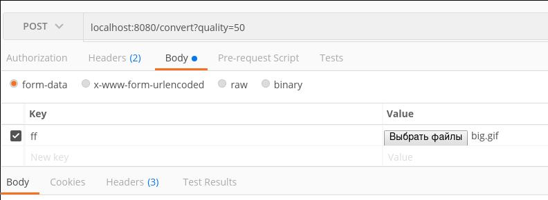

# Webp

## Description

`gif2webp` converts a GIF image to a WebP image.

It is the web service to convert images to webp.

## Run

0. Clone the repository.

1. Build and run container:

```bash
$> sudo docker build -t gif2webp .
$> sudo docker run -it --rm -p 8080:8080 gif2webp
# You will see:
... Start gif2web server on 8080
```

2. Submit a `POST` request to `http://localhost:8080/convert?quality=30` with `gif` image. The `quality` parameter can be from `0` to `100`.

<p align="left"></p>

The `gif` will be converted to `webp` and sended in response.

